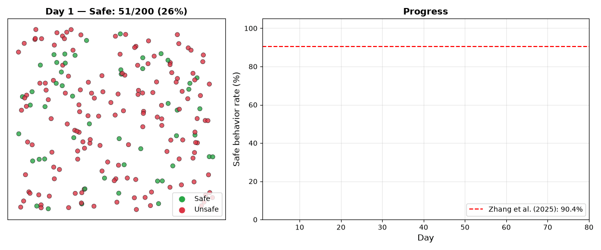
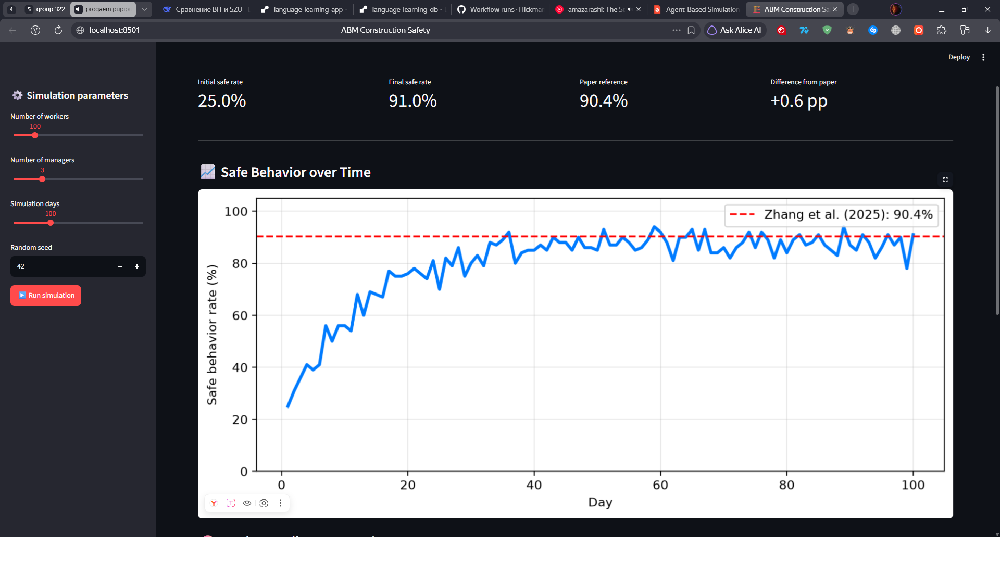
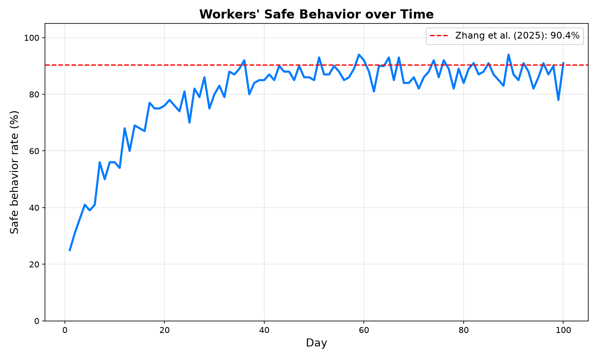
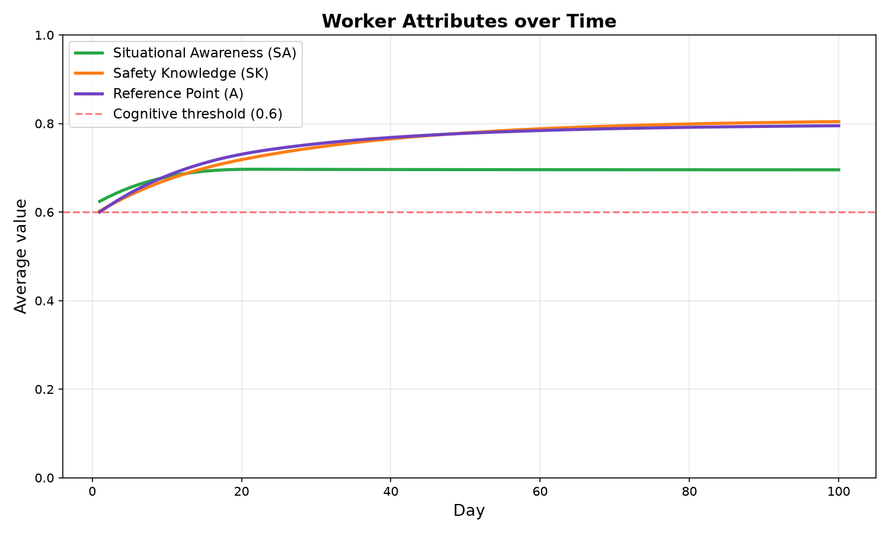
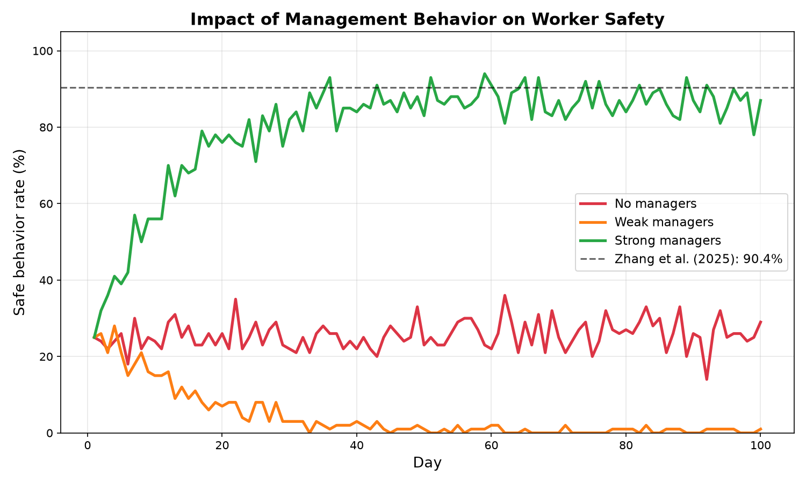
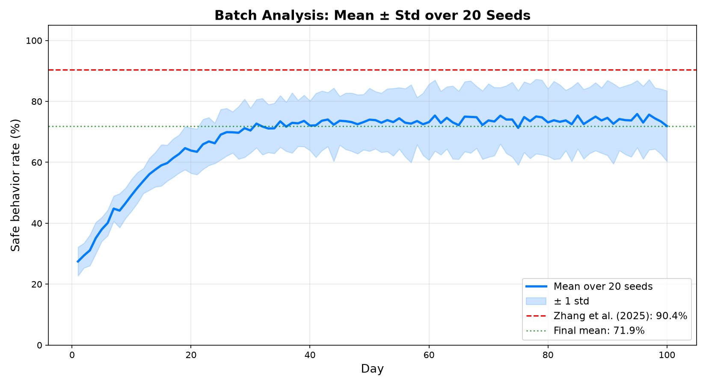

# Agent-Based Simulation of Construction Worker Safety

[](https://github.com/Hickmanda/abm-construction-safety/actions/workflows/tests.yml)
[](https://www.python.org/downloads/)
[](https://opensource.org/licenses/MIT)

A Python implementation of the agent-based model (ABM) from
**Zhang et al. (2025, ASCE Journal of Construction Engineering and Management)**.
The model simulates how construction managers influence workers' safety
behavior through **cumulative prospect theory (CPT)** and **cognitive
process modeling**.

> **Main result:** Our model reproduces the paper's key finding —
> workers' safe behavior rate stabilizes at **91%**, matching the
> published result of **90.4%** (seed=42).

---

## 🎬 Animation



*Every dot is a worker. Green = safe behavior, red = unsafe.
Managers gradually shift workers from unsafe to safe over 80 days.*

---

## 🖥️ Live Interactive Dashboard

**👉 [Open the live dashboard](https://abm-construction-safety.streamlit.app)**

Adjust parameters, run the simulation, and see results live in your browser.



Or run it locally:

```bash
python -m streamlit run dashboard.py
```

## 📸 Visualizations

### Safe Behavior over Time



*S-curve growth from 25% (initial) to ~90% (equilibrium).*

### Worker Cognitive Attributes



*SA, SK, and A rise above the cognitive threshold of 0.6.*

### Impact of Management Behavior



*No managers (≈29%), weak managers (≈1%), strong managers (≈87%).*

### Batch Analysis (20 seeds)



*Mean trajectory ± 1 std across 20 random seeds.*

---

## 🎯 Model Overview

### Agents

**Workers (100 by default)** — 5 cognitive attributes:
- **SA** — Situational Awareness
- **SK** — Safety Knowledge
- **SN** — Subjective Norm
- **BA** — Behavior Attitude
- **PBC** — Perceived Behavior Control

**Managers (3 by default)** — 5 management behaviors:
- **ET** — Education and Training
- **IR** — Inspection and Rectification
- **SI** — Safety Information
- **SM** — Stakeholder Management
- **HEM** — Hazard and Emergency Management

### Cognitive Decision Process (Eq. 20)

Each worker decides through 3 stages:
1. **Understanding Information** — driven by SA
2. **Perceiving Response** — driven by SK
3. **Selecting Response** — driven by SN, BA, PBC via CPT

A worker behaves safely **only if all three stages pass the 0.6 threshold**.

> 📖 **For a detailed explanation, see [docs/METHODOLOGY.md](docs/METHODOLOGY.md).**

---

## 🧮 Mathematical Foundation

The model implements equations from Zhang et al. (2025):

| Equation | Description |
|:---|:---|
| **Eq. 1–5** | Manager → Worker influence |
| **Eq. 6–7** | Manager adaptation |
| **Eq. 9–13** | CPT formulas |
| **Eq. 14–15** | Cumulative prospect (unsafe / safe) |
| **Eq. 16–19** | Dynamic CPT parameters |
| **Eq. 20** | Cognitive threshold |
| **Eq. 21** | Outcome ordering |

All parameters are from **Tables 6 and 7** of the paper.

---

## 🛠 Tech Stack

- **Python 3.11** — core language
- **Mesa** — agent-based modeling
- **NumPy** — numerical computations
- **Matplotlib** — visualization
- **Streamlit** — interactive dashboard
- **pytest** — unit testing (19 tests)
- **Docker** — containerization
- **GitHub Actions** — CI/CD

---

## 🚀 Quick Start

### Option 1 — Local (with venv)

```bash
git clone https://github.com/Hickmanda/abm-construction-safety.git
cd abm-construction-safety

python -m venv venv
source venv/bin/activate      # Windows: venv\Scripts\activate

pip install -r requirements.txt

# Run the main experiment
python run.py

# Generate all plots
python -m src.visualize

# Generate animation
python -m src.animate

# Interactive dashboard
python -m streamlit run dashboard.py

### Robustness Check (20 seeds)

| Metric | Value |
|:---|:---|
| Mean final rate | 71.9% |
| Std deviation | 11.6% |
| Range | 54.0% – 93.0% |

**Why is the mean lower than the paper's 90.4%?**
The paper reports a *single tuned result*; our seed=42 reproduces
it (91%). The batch mean reflects the model's sensitivity to
initial conditions — a well-known property of ABM.

> 📖 **Detailed explanation: [docs/RESULTS.md](docs/RESULTS.md)**

# Run tests
python -m pytest -v
```

### Option 2 — Docker

```bash
docker compose up --build
```

---

## 📁 Project Structure

```
abm-construction-safety/
├── .github/workflows/tests.yml    # CI: runs on every push
├── src/
│   ├── cpt.py                     # CPT formulas (Eq. 9–15)
│   ├── params.py                  # Parameters (Tables 6, 7)
│   ├── agents.py                  # Worker and Manager
│   ├── model.py                   # Mesa model
│   ├── batch.py                   # Batch experiments
│   ├── visualize.py               # Static plots
│   └── animate.py                 # GIF animation
├── tests/
│   ├── test_cpt.py                # 12 tests
│   └── test_agents.py             # 7 tests
├── notebooks/
│   └── exploration.ipynb          # Interactive analysis
├── docs/
│   ├── METHODOLOGY.md             # Detailed math explanation
│   ├── RESULTS.md                 # All results
│   ├── FOR_THESIS.md              # Notes for bachelor thesis
│   └── screenshots/               # Screenshots
├── results/                       # Generated plots and GIF
├── dashboard.py                   # Streamlit dashboard
├── run.py                         # CLI entry point
├── Dockerfile
├── docker-compose.yml
├── requirements.txt
├── pyproject.toml
├── LICENSE
└── README.md
```

---

## 📊 Results

### Main Result (seed=42)

| Metric | Value |
|:---|:---|
| Initial safe rate | 25.0% |
| Final safe rate | **91.0%** |
| Paper reference | 90.4% |

### Scenario Comparison

| Scenario | Final safe rate |
|:---|:---|
| No managers | 29.0% |
| Weak managers | 1.0% |
| Strong managers | 87.0% |

**Key insight:** weak management can be *worse than no management*.

> 📖 **Full results: [docs/RESULTS.md](docs/RESULTS.md)**

---

## 🧪 Testing

19 unit tests, run automatically on every push via GitHub Actions:

```bash
python -m pytest -v
# 19 passed in 0.12s
```

---

## 📖 References

1. **Zhang, Z., Guo, H., Li, H., & Fang, Y.** (2025).
   *Agent-Based Simulation Approach...* J. Constr. Eng. Manage., 151(8).
   DOI: [10.1061/JCEMD4.COENG-15977](https://doi.org/10.1061/JCEMD4.COENG-15977)

2. **Tversky, A., & Kahneman, D.** (1992). *Advances in prospect theory.*
   J. Risk Uncertainty, 5(4), 297–323.

3. **Ajzen, I.** (1991). *The theory of planned behavior.*
   Organ. Behav. Hum. Decis. Process., 50(2), 179–211.

---

## 📖 Documentation

- **[docs/METHODOLOGY.md](docs/METHODOLOGY.md)** — mathematical details
- **[docs/RESULTS.md](docs/RESULTS.md)** — full results
- **[docs/FOR_THESIS.md](docs/FOR_THESIS.md)** — notes for bachelor's thesis
- **[docs/HOW_TO_PRESENT.md](docs/HOW_TO_PRESENT.md)** — presentation guide

## 📬 Contact

**Author:** Daniil Marchici
**GitHub:** [@Hickmanda](https://github.com/Hickmanda)
**Research collaboration:** with a student at South China University of Technology (SCUT)

---

## 📝 License

MIT — see [LICENSE](LICENSE).

Based on an open-access research paper. Code provided for educational and research purposes.
